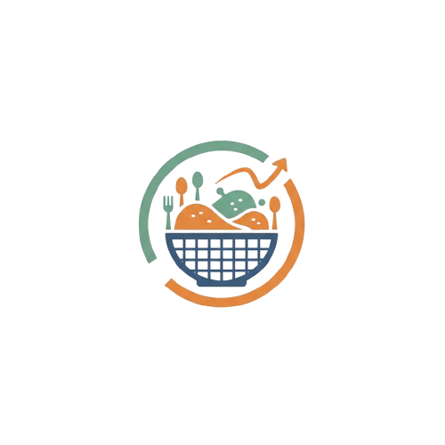

# 🍱 MealMatrix — Food Donation Tracker

A web application that connects **Donors**, **Recipients**, and **Admins** to manage food donations efficiently.

## 🧩 Features
- 👑 **Admin Dashboard** – Manage users, donations, and requests.
- 🍱 **Donor Dashboard** – Add and view your donations.
- 🤝 **Recipient Dashboard** – Request available donations.
- 📦 MySQL + Node.js backend.
- ✨ Gradient UI and responsive design.

## 🖼️ Logo


## ⚙️ Tech Stack
- Frontend: HTML, CSS, JavaScript  
- Backend: Node.js, Express.js  
- Database: MySQL  
- Version Control: Git & GitHub  

---

### 🚀 Setup
1. Clone the repository  
   ```bash
   git clone https://github.com/YOUR_USERNAME/MealMatrix.git
Install backend dependencies

bash
Copy code
cd backend
npm install
npm run dev
Open frontend/index.html in browser.